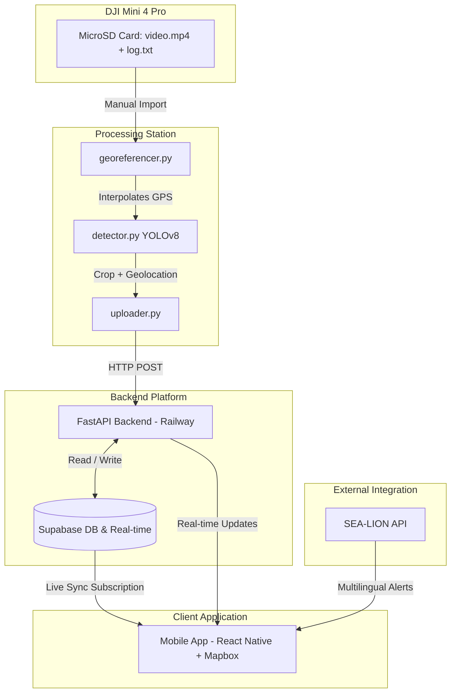

# 🌊 Beach Litter Management System

An end-to-end aerial surveillance and volunteer coordination platform. This system processes post-flight drone videos with GPS telemetry, detects litter via YOLOv8, georeferences target pins, streams updates in real-time via FastAPI and Supabase, and displays actionable cleanup zones for volunteers on a mobile app powered by Mapbox.

---

## 📌 Architecture Overview



---

## 📂 Repository Structure

```
├── backend/                  # FastAPI Backend Platform
│   ├── config.py             # Configuration / Environment vars
│   ├── main.py               # FastAPI App entrypoint
│   ├── routes.py             # REST API routes (pins, zones, alerts, exports)
│   ├── processing_task.py    # Survey pipeline orchestration & live stage state
│   ├── sahi_slicer.py        # SAHI tile decomposition + NMS box merging
│   ├── parallel_inference.py # Multi-core / GPU inference pool
│   ├── exporters.py          # CSV / GeoJSON / PDF agency evidence exports
│   ├── sealion.py            # SEA-LION LLM translation service
│   └── requirements.txt      # Backend Python dependencies
│
├── processing_station/       # YOLOv8 + GPS Georeferencer
│   ├── detector.py           # YOLOv8 object detection module
│   ├── georeferencer.py      # GPS log interpolation from flight telemetry
│   ├── uploader.py           # API uploader script
│   └── requirements.txt      # Processing station Python dependencies
│
├── mobile/                   # React Native Mobile App
│   ├── App.js                # Core App component and routing
│   ├── package.json          # Mobile dependencies & scripts
│   ├── assets/
│   │   └── litter-alert.wav  # New-detection notification chime
│   ├── components/
│   │   ├── LitterAlertBanner.js  # Animated new-litter alert banner
│   │   └── NewPinPulse.js        # Radar pulse on freshly detected pins
│   └── screens/
│       ├── MapScreen.js      # Mapbox pins & zone visualization
│       └── AlertsScreen.js   # Multilingual notifications
│
└── supabase/                 # Supabase configuration & migrations
    └── schema.sql            # Database schema & RLS setup
```

---

## 🔬 SAHI Tiled Detection Pipeline

Drone footage is captured 30–80 m above ground, so a plastic bottle occupies only a
handful of pixels in a 4K frame. Feeding a whole frame to YOLO downscales it to
640×640 and those objects disappear entirely.

**SAHI (Slicing Aided Hyper Inference)** instead cuts every sampled frame into
overlapping tiles, runs detection on each tile at *native resolution*, maps the boxes
back into full-frame coordinates, and merges the duplicates that the overlap produces
using non-max suppression plus a containment test for boxes clipped at a tile edge.

A 3840×2160 frame at the default 640 px tile / 20 % overlap becomes **32 tiles**, so
the pipeline runs a worker pool to keep the hardware saturated.

### Compute planning

The pipeline auto-selects device, worker count and tile batch size together, because
the right answer differs sharply by backend. Measured on an M1 Pro (10 cores) over 8
frames of 4K footage at 32 tiles/frame — **all configurations returned identical
detections**:

| Device | Workers | Batch | Time per frame |
| :--- | ---: | ---: | ---: |
| CPU | 9 | 4 | 4.61 s |
| CPU | 6 | 4 | 2.82 s |
| CPU | 8 | 2 | 2.08 s ← best CPU |
| MPS | 1 | 16 | 1.25 s |
| **MPS** | **2** | **16** | **1.13 s ← best overall** |

A GPU is a single shared resource, so piling on processes only adds contention; it
gets a small pool sized to keep it fed. CPU-only machines do want one process per
core, but with *small* batches — large batches there blow the cache.

> [!NOTE]
> Two subtleties are handled explicitly. Ultralytics calls `torch.set_num_threads(8)`
> at import, so each worker re-pins itself to one thread **after** importing YOLO —
> without this, N workers spawn N×8 threads and thrash the scheduler (~5× slower).
> Frames also cross the process boundary as JPEG bytes (~400 KB) rather than raw
> arrays (~25 MB).

Frame-parallel inference means Bot-SORT tracking is unavailable, so detections are
de-duplicated across frames by spatial proximity (same class within 3 m) — which is
more robust anyway when the drone revisits the same ground on a later pass.

If the worker pool dies mid-survey, the run degrades to single-process rather than
failing the mission.

---

## 🏛️ Government Agency Export

Every completed survey can be published as an evidence package from the **Share with
Agencies** panel on the dashboard, or from the API directly:

| Format | Endpoint | Purpose |
| :--- | :--- | :--- |
| **CSV** | `GET /api/export/csv?mission_id=…` | Opens in Excel; ingests into municipal databases |
| **GeoJSON** | `GET /api/export/geojson?mission_id=…` | Drops straight into QGIS / ArcGIS / Google Earth |
| **PDF** | `GET /api/export/pdf?mission_id=…` | Formal situation report for filing or forwarding |
| _preview_ | `GET /api/export/summary?mission_id=…` | Record counts and survey extent, no download |

Every export carries provenance — mission, capture time, model confidence and
detection method — so a receiving agency can audit where a coordinate came from.
GeoJSON declares WGS84 (CRS84) explicitly and uses `[longitude, latitude]` ordering
per RFC 7946.

> PDF export requires `reportlab` (included in `backend/requirements.txt`). CSV and
> GeoJSON work without it; the PDF endpoint returns a clear 503 if it is missing.

---

## 📱 Mobile Litter Alerts

When a survey publishes new pins over Supabase real-time, volunteers get:

- an **animated banner** that springs down from the top with a pulsing radar ring,
  showing the count, coordinates and confidence — tap it to fly the map to the pin;
- a **notification chime** (`assets/litter-alert.wav`, a rising two-note bell) that
  plays even when the iOS ringer switch is off;
- **haptic feedback** on supported devices;
- a **radar pulse** on the map marker itself for 25 s after detection.

Bursts of detections are batched into a single banner and one chime rather than a
stampede of alerts. Requires `expo-audio` and `expo-haptics`, both bundled in
Expo Go for SDK 54 — no development build needed for a demo.

---

## ⚙️ Setup and Installation

### 1. Database (Supabase) Setup
1. Create a new project in your [Supabase Dashboard](https://supabase.com).
2. Open the **SQL Editor** in the Supabase Dashboard, create a new query, copy the entire contents of [supabase/schema.sql](file:///Users/prakash/Desktop/DJI-Flight-Volunteer-App/supabase/schema.sql), and run it. This will create the required tables (`profiles`, `litter_pins`, `cleanup_zones`, `alerts`, `missions`), set up spatial indexes, and enable real-time publications.
3. Open the **Storage** section in the Supabase Dashboard:
   - Create a new bucket named **`litter-images`**.
   - Make sure you check **Public** (allow public access) so that images can be loaded directly from URLs in the mobile client.
4. Retrieve your **Project URL** and API keys:
   - Go to **Project Settings** -> **API**.
   - Copy the **Project URL**.
   - Copy the **`anon` (public)** key (for the mobile client).
   - Copy the **`service_role`** key (for the backend server to bypass RLS policies).

---

### 2. Environment Configuration (`.env`)

The repository contains three sub-projects, each requiring its own `.env` configuration. Ensure you copy the examples and fill in your keys correctly:

| Module | Env File Location | Source Command | Key Variables & Description |
| :--- | :--- | :--- | :--- |
| **FastAPI Backend** | `backend/.env` | `cp backend/.env.example backend/.env` | `SUPABASE_URL`: Your Supabase URL.<br>`SUPABASE_KEY`: Your Supabase **service_role** key (required to authenticate backend CRUD operations).<br>`SEA_LION_API_KEY`: SEA-LION translation model key (leave blank to use offline mock fallbacks).<br>`HOST`: `127.0.0.1` (local)<br>`PORT`: `8000` (default) |
| **Processing Station** | `processing_station/.env` | `cp processing_station/.env.example processing_station/.env` | `ROBOFLOW_PUBLISHABLE_KEY`: Roboflow model inference access key.<br>`MAPBOX_ACCESS_TOKEN`: Mapbox API token (if needed by mapping tools). |
| **Mobile Client** | `mobile/.env` | `cp mobile/.env.example mobile/.env` | `EXPO_PUBLIC_SUPABASE_URL`: Same Supabase project URL.<br>`EXPO_PUBLIC_SUPABASE_ANON_KEY`: Supabase **anon/public** key (safe to package in mobile client builds). |

> [!IMPORTANT]
> For the React Native Expo app, environment variables must start with the prefix `EXPO_PUBLIC_` so that the Metro bundler injects them into the runtime environment.

---

### 3. FastAPI Backend Setup
```bash
# Navigate to the backend directory
cd backend

# Create and activate a Python virtual environment
python -m venv venv
source venv/bin/activate  # On Windows, use: venv\Scripts\activate

# Install all backend Python dependencies
pip install -r requirements.txt

# Start the FastAPI server using the entrypoint script
python main.py
```
The backend server will run on `http://127.0.0.1:8000`. You can access the Command Center Dashboard at `http://127.0.0.1:8000/api/dashboard` or browse the interactive documentation at `http://127.0.0.1:8000/docs`.

---

### 4. Processing Station Setup (YOLO + Telemetry)
```bash
# Navigate to the processing station directory
cd processing_station

# Create and activate a Python virtual environment
python -m venv venv
source venv/bin/activate  # On Windows, use: venv\Scripts\activate

# Install processing station dependencies (includes PyTorch & OpenCV)
pip install -r requirements.txt
```

To run a georeferencing detection session:
- **Real Run** (processes OpenCV video stream and runs YOLOv8 models):
  ```bash
  python detector.py --video path/to/video.mp4 --telemetry path/to/telemetry_log.csv --backend http://localhost:8000 --model solar_panel.pt
  ```
- **Mock Run** (simulates flight and coordinates, sending test pins to backend without needing OpenCV/YOLO installed):
  ```bash
  python detector.py --video mock.mp4 --telemetry mock_telemetry.csv --backend http://localhost:8000 --mock
  ```

---

### 5. Mobile App Setup (React Native + Expo)
```bash
# Navigate to the mobile directory
cd mobile

# Install Node modules and native dependencies
npm install

# Start the Expo Metro Bundler
npm start
```
For physical mobile testing:
1. Download the **Expo Go** application from the iOS App Store or Android Play Store.
2. Start the bundler with an ngrok/expo tunnel:
   ```bash
   npm start -- --tunnel
   ```
3. Scan the QR code displayed in your terminal using the Expo Go application or your camera app.

---

## 🧪 Verification and Testing

You can verify that the system setups, configurations, and API endpoints are working properly by running the automated unit and integration tests from the root of the repository:

### Test Supabase Connection & CRUD Schemas
Make sure you have completed the backend `.env` configuration. Then run:
```bash
python test_supabase.py
```

### Test General Integration Pipelines
To test the georeferencing interpolation, SEA-LION fallback translations, and FastAPI process tasks, run:
```bash
python test_system.py
```
